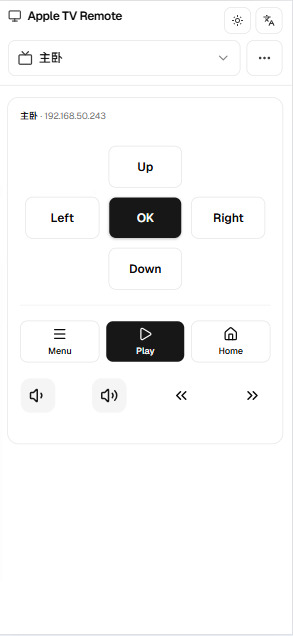

# Apple TV Remote · Web UI

Web client for controlling Apple TV on your LAN: device scan and pairing, D-pad and media keys, **English / Chinese UI**, and **light / dark / system** theme. Production builds are served by the FastAPI backend in the same process; during development, Vite proxies `/api` to a local server.



## Local development

1. Install dependencies: `npm ci` (or `npm install`).
2. Start the API from the repo’s `backend` folder (default port **8765**), for example:  
   `uvicorn main:app --host 0.0.0.0 --port 8765`
3. In this directory run: `npm run dev`  
   The dev server proxies `/api` to `http://127.0.0.1:8765` (see `vite.config.ts`).

## Production build

```bash
npm run build
```

Output goes to `dist/`. The root Docker image copies that folder into the container so `uvicorn` can serve both the SPA and `/api`.

## Deployment 

From the **repository root**:

```bash
docker build -t apple-tv-remote .
docker run --rm -p 8765:8765 -v atv-data:/data apple-tv-remote
```

Or with Compose:

```bash
docker compose up --build
```

Open **http://localhost:8765** in your browser. Pairing data is persisted under the container volume `/data` (see `PYATV_STORAGE`).

> **Note:** If the container cannot discover Apple TVs on your LAN (common on Linux with bridge networking), switch to `network_mode: host` in `docker-compose.yml` as described in the comments there (use either host networking or `ports`, not both).
